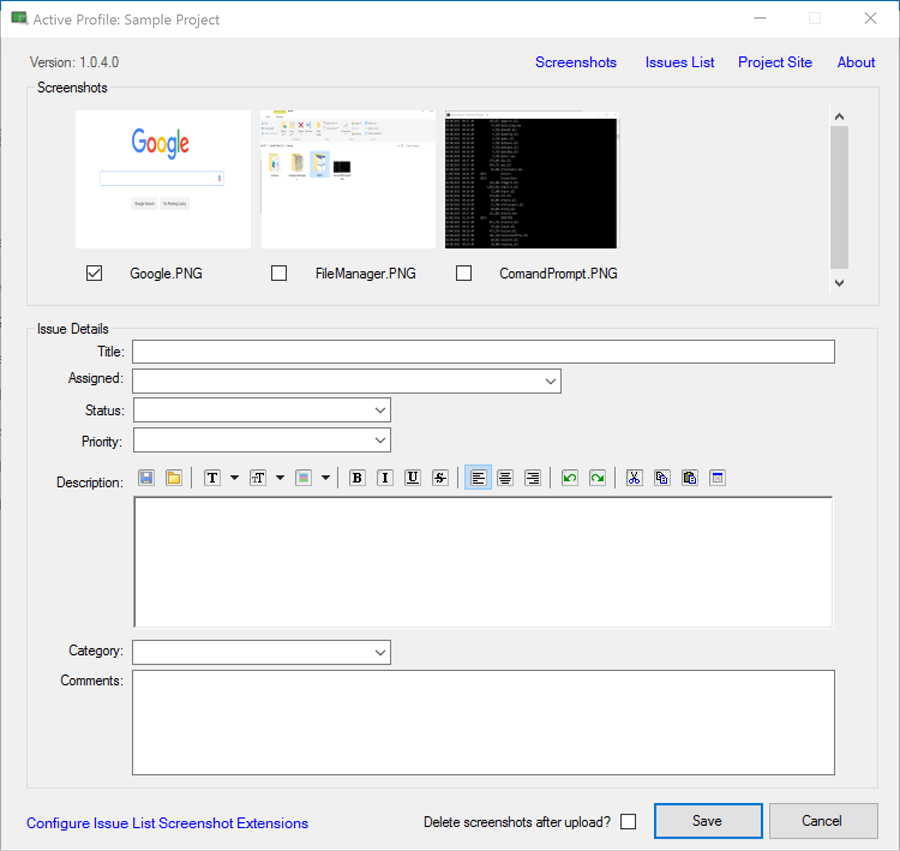

# Issue Creator for SharePoint/O365
A Windows application for quickly creating issues, in a standard SharePoint issues list, that contain screenshots.

[Download][dl-latestversion] the latest version.

## Key Features
- Multiple profiles supporting any number of Issue List/Screenshot folder combinations
- Upload multiple screenshots at any time (and optionally delete them after upload)
- Support for all standard Issue fields (and their drop down values)
- Accessible from the system tray (optionally open automatically on screenshot save)
- Automatically updates to the latest version
- Shortcuts to the active Issues List, Site and Screenshot folder.
- Enlarged, resizeable previews of the screenshots available by clicking
- Optionally install extensions to the standard SharePoint Issue Display Form that adds previews to the screenshots
- Works with any existing screenshot tool (simply pulls images from a folder)

[dl-latestversion]: releases/download/1.0.5/RapidIssue-1_0_5.zip
